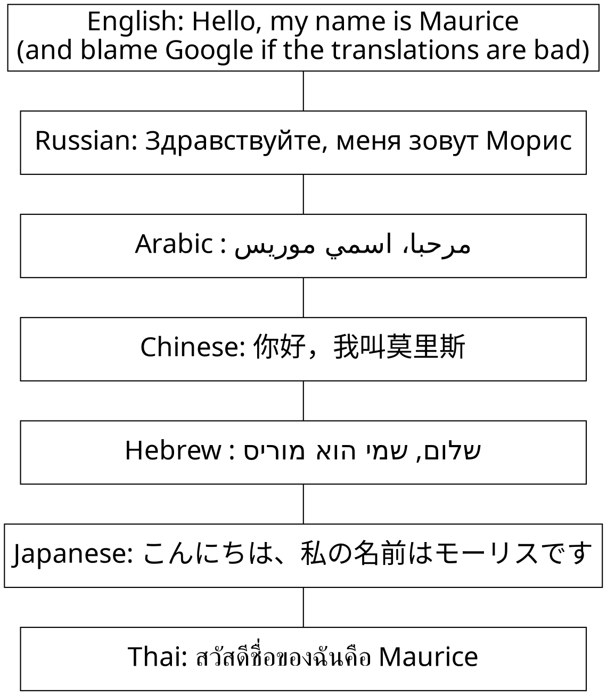

# procs-graphviz.md
⊕ [User Guide — graphviz 0.10.1 documentation](https://graphviz.readthedocs.io/en/stable/manual.html)
⊕ [graphviz/manual.rst at 1377ec44eb7431c728a21f5739297c087385b3b4 · xflr6/graphviz](https://github.com/xflr6/graphviz/blob/1377ec44eb7431c728a21f5739297c087385b3b4/docs/manual.rst)

⊕ [Examples — graphviz 0.10.1 documentation](https://graphviz.readthedocs.io/en/stable/examples.html)
⊕ [Node, Edge and Graph Attributes](https://www.graphviz.org/doc/info/attrs.html)
⊕ [Forever For Now - UML Diagrams Using Graphviz Dot](http://www.ffnn.nl/pages/articles/media/uml-diagrams-using-graphviz-dot.php)

+ procs-graphviz.ipynb
+ procs-ofbiz-model-graph.ipynb

⊕ [Node, Edge and Graph Attributes](https://www.graphviz.org/doc/info/attrs.html#k:style)
    Basic style settings for nodes; 
    Basic style settings for edges; 
    ⊕ [Color Names](https://www.graphviz.org/doc/info/colors.html)

## 解决显示Arabic文本的问题
⊕ [GraphVizio – A Graphviz addin for Visio » Maurice's Musings](https://www.calvert.ch/maurice/2010/05/11/graphvizio-a-graphviz-addin-for-visio/)
    * 改变字体: fontname=Calibri

